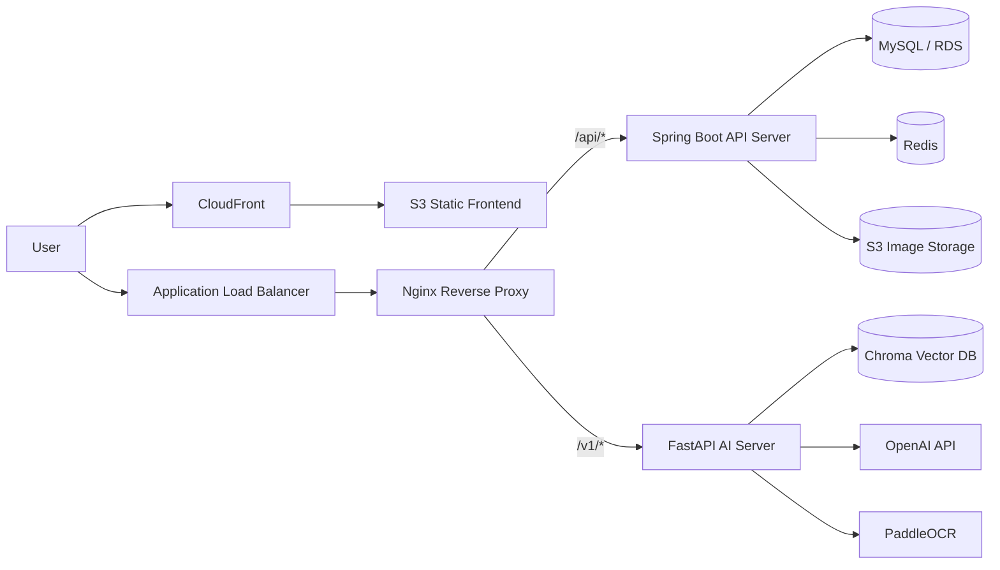
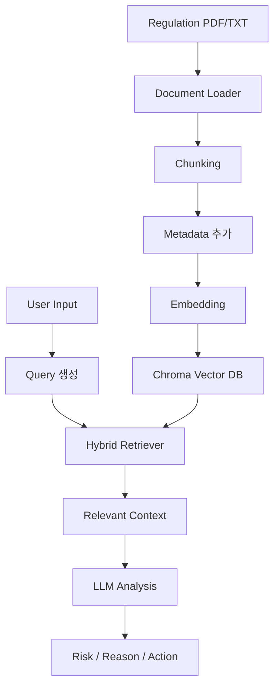

# COSY

> AI 기반 화장품 수출 규제 적합성 검토 서비스  
> 제품의 전성분과 라벨/마케팅 문구를 입력하면 국가별 규제 문서를 기반으로 위험도를 분석하고, 수정 제안 및 PDF 보고서를 제공합니다.

 

## 1. 프로젝트 소개

COSY는 화장품을 해외 시장에 수출할 때 필요한 성분 규제와 표시·광고 규제 검토 과정을 자동화하기 위한 서비스입니다.  
국가별 규제 문서는 형식과 기준이 다르고, 기업 담당자가 성분표와 마케팅 문구를 직접 대조하는 데 많은 시간이 소요됩니다.

COSY는 다음 과정을 통해 규제 검토를 지원합니다.

1. 국가별 화장품 규제 문서 수집 및 벡터 DB 저장
2. 사용자가 입력한 전성분 또는 마케팅 문구 분석
3. Hybrid Retrieval 기반 관련 규정 검색
4. LLM 기반 규제 위반 가능성 판단
5. 위험도, 규제 근거, 권장 조치, 수정 문구 제공
6. 분석 결과 PDF 보고서 다운로드

 

## 2. 주요 기능

| 구분 | 기능 |
| --- | --- |
| 회원/인증 | 회원가입, 로그인, JWT 기반 인증, 토큰 재발급, 로그아웃 |
| 제품 관리 | 회사 단위 제품 등록, 조회, 수정, 삭제, 이미지 업로드 |
| 전성분 검토 | 국가별 금지/제한/조건부 허용 성분 검토 |
| 문구 검토 | 라벨·마케팅 문구의 오인 표현, 금지 표현, 주의 표현 검토 |
| OCR | 제품 이미지에서 텍스트 추출 |
| RAG 검색 | Chroma Vector DB + BM25 기반 Hybrid Retrieval |
| 보고서 | 검토 결과 PDF 생성 및 ZIP 일괄 다운로드 |
| 배포 | Docker, Nginx, AWS EC2/ECR/S3/CloudFront, GitHub Actions 기반 CI/CD |

 

## 3. 기술 스택

### Frontend

- React 19
- Vite
- Axios
- Lucide React

### Backend

- Java 17
- Spring Boot 4.0.1
- Spring Security
- Spring Data JPA
- MySQL
- Redis
- JWT
- AWS S3 SDK

### AI Server

- Python 3.10
- FastAPI
- LangChain
- Chroma DB
- BM25 Retriever
- OpenAI API
- PaddleOCR
- fpdf2

### Infra / DevOps

- Docker
- Nginx
- GitHub Actions
- AWS EC2
- AWS ECR
- AWS S3
- AWS CloudFront
- AWS ALB

 

## 4. 시스템 아키텍처

 

## 5. 서버 분리 구조

COSY는 백엔드를 Spring Boot 서버와 FastAPI 서버로 분리했습니다.

| 서버 | 역할 |
| --- | --- |
| Spring Boot | 인증, 회원, 회사, 제품, 로그 등 일반 비즈니스 API 처리 |
| FastAPI | OCR, RAG 검색, LLM 분석, 보고서 생성 등 AI 기능 처리 |
| Nginx | `/api/*` 요청은 Spring Boot로, `/v1/*` 요청은 FastAPI로 라우팅 |

 

## 6. RAG 구조

COSY의 규제 검토는 단순 LLM 응답이 아니라, 국가별 규제 문서를 검색한 뒤 검색 결과를 근거로 판단하는 RAG 구조로 동작합니다.

### 문서 저장 방식

규제 문서는 국가와 도메인 정보를 metadata로 함께 저장합니다.

| Metadata | 설명 |
| --- | --- |
| `country` | JP, US, EU, CN 등 검토 국가 |
| `domain` | ingredients, labeling 등 규제 영역 |
| `title` | 원본 문서명 |
| `source` | 원본 파일 경로 |

이를 통해 사용자가 특정 국가와 검토 영역을 선택하면 해당 조건에 맞는 문서만 검색하도록 범위를 제한했습니다.

 

## 7. Hybrid Retrieval 적용

초기에는 벡터 유사도 검색만 사용했지만, 화장품 성분명은 의미적 유사도보다 정확한 키워드 매칭이 중요한 경우가 많았습니다.  
예를 들어 특정 성분명이 규제 목록에 존재하는지 확인해야 하는 상황에서는 벡터 검색만으로는 관련 문서를 놓칠 수 있었습니다.

이를 개선하기 위해 벡터 검색과 BM25 키워드 검색을 결합한 Hybrid Retrieval을 적용했습니다.

### 검색 전략

| 검토 유형 | 검색 전략 |
| --- | --- |
| 전성분 검토 | 성분명 정확도가 중요하므로 BM25 비중을 높게 적용 |
| 라벨/문구 검토 | 표현의 의미와 문맥이 중요하므로 벡터 검색 비중을 높게 적용 |
